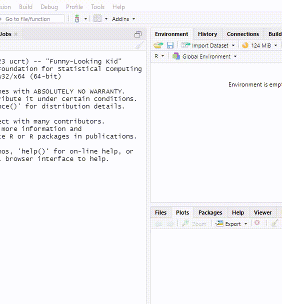

<!-- README.md is generated from README.Rmd. Please edit that file -->

```{r, include = FALSE}
knitr::opts_chunk$set(
  collapse = TRUE,
  comment = "#>",
  fig.path = "man/figures/README-",
  out.width = "100%"
)
```

# checkeR

<!-- badges: start -->
<!-- badges: end -->

`{checkeR}` is an add-in package for RStudio that checks for updates to R.

## Installation

You can install the development version of `{checkeR}` like so:

``` r
# install.packages("devtools")
devtools::install_github("indenkun/checkeR")
```

## Example

Once the package is installed, it will be registered as an add-in to RStudio and can be used.

A dialog will indicate if there are updates available.



This is a wrapper for `check.for.updates.R()` of the `{installr}`.

## Import

* `{installr}`
* `{purrr}`
* `{stringr}`
* `{rstudioapi}`

## Notice

The email address listed in the DESCRIPTION is a dummy. If you have any questions, please post them on ISSUE.
